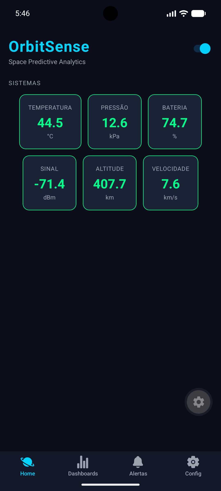
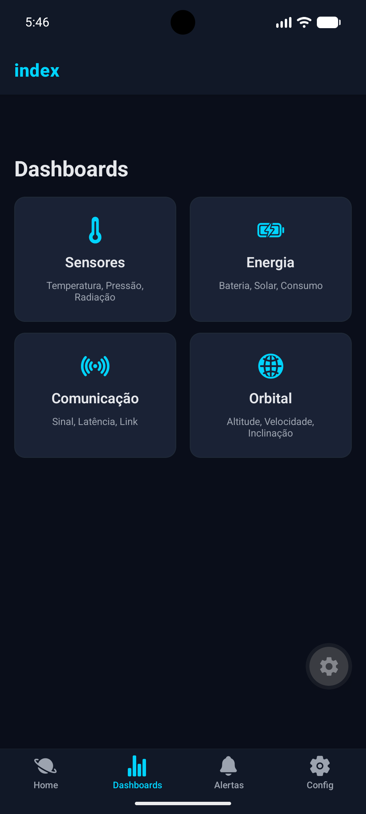
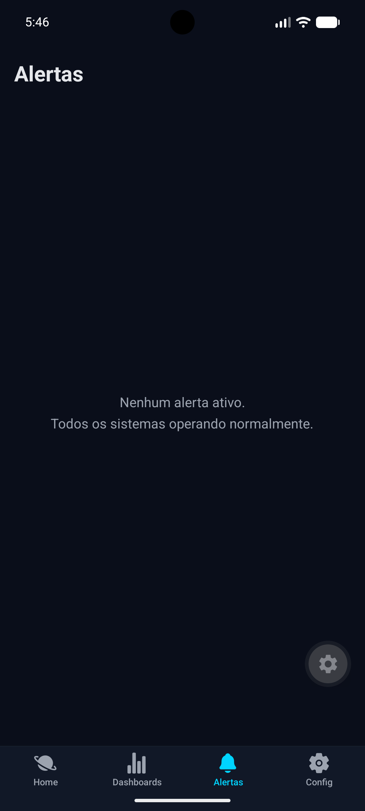
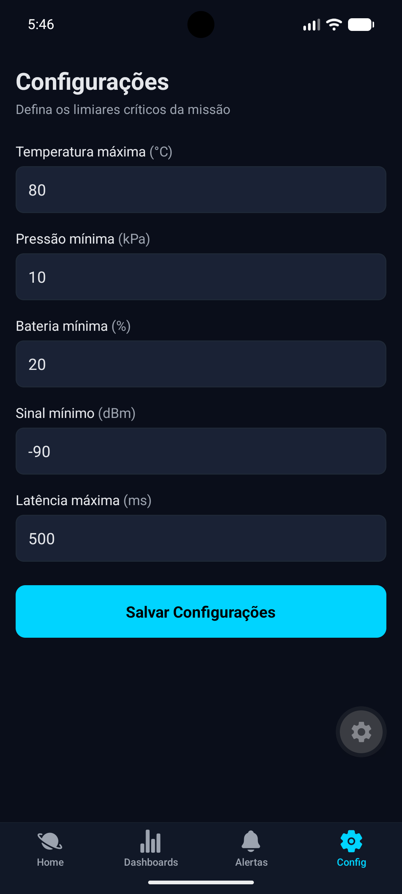

# OrbitSense 🛰️
### Global Solution 2026.1 — Cross-Platform Application Development | FIAP

## Descrição

OrbitSense é uma plataforma mobile de análise preditiva espacial que monitora sistemas de uma missão orbital simulada em tempo real. A solução coleta e processa dados de sensores, energia, comunicação e estabilidade orbital, gerando alertas automáticos quando limiares críticos são ultrapassados. O diferencial está na visualização temática espacial com dark mode nativo e gráficos históricos de cada sistema.

## Equipe

| Nome | RM |
|------|----|
| [Guilherme Carreri Giampietro] | RM565676 |
| [Arthur Souza Matos Dias] | RM566068 |

## Telas do Aplicativo

### Home — Dashboard Principal
Visão geral dos indicadores da missão com status colorido por sistema e badge de alertas críticos.



### Dashboards — Lista
Grid de acesso aos 4 dashboards analíticos.



### Dashboard de Sensores
Temperatura, pressão e radiação com gráfico de linha histórico.


### Dashboard de Energia
Nível de bateria, produção solar e consumo com barras de progresso.


### Dashboard de Comunicação
Status do link de telemetria, sinal e latência com badge ONLINE/DEGRADED/LOST.


### Dashboard Orbital
Altitude, velocidade e inclinação orbital com gráfico de altitude histórico.


### Alertas
Lista de alertas gerados automaticamente com nível de criticidade e timestamp.



### Configurações
Formulário de configuração dos limiares de alerta com validação e persistência.



## Funcionalidades

- [x] Dashboard com indicadores em tempo real (simulado, atualiza a cada 2s)
- [x] Sistema de alertas automáticos por limiar crítico (com deduplicação)
- [x] Persistência de limiares e histórico de alertas com AsyncStorage
- [x] Navegação com Expo Router (Tabs + Stack)
- [x] Context API para estado global da missão
- [x] Formulário de configuração com validação
- [x] Dark Mode completo com paleta temática espacial
- [x] TypeScript em todo o projeto

## Tecnologias

- React Native + Expo SDK 56
- Expo Router v4
- AsyncStorage (`@react-native-async-storage/async-storage`)
- Context API
- TypeScript (strict mode)
- `react-native-chart-kit` para gráficos
- `@expo/vector-icons` para ícones

## Como Executar

### Pré-requisitos
- Node.js instalado
- Expo Go instalado no celular (iOS ou Android)

### Instalação

```bash
git clone https://github.com/carrerigcg/GS---Cross-Plataform.git
cd GS---Cross-Plataform
npm install
npx expo start
```

Escaneie o QR Code com o Expo Go para rodar no dispositivo físico.

## Testes

```bash
npm test
```

Suite de 11 testes cobrindo:
- `useAsyncStorage` — save/load round-trip e null-on-missing-key (2 testes)
- `MissionContext.checkThresholds` — lógica de geração e deduplicação de alertas (5 testes)
- `settings.validateThresholds` — validação do formulário de limiares (4 testes)

## Vídeo de Demonstração

[Clique aqui para assistir à demonstração](https://youtube.com/...)

## Licença

Este projeto foi desenvolvido para fins acadêmicos — FIAP 2026.
